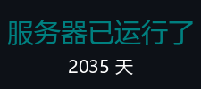

<!-- 标题 -->
<h1 align="center">牛腩小镇 | NewNanCity | JE 1.20.1</h1>

<!-- 横幅 -->
<p align="center"></p>
<p align="center">&nbsp;
&nbsp;
</p>

<p align="center"></p>
<!-- 欢迎信息 -->
<h3 align="center">/spawn</h3>
<p align="center">欢迎你牛子！牛腩小镇是一个开服超过五年，合计超过2000+玩家的中文圈插件生存服务器。</p>
<p align="center">在这里你可以体验我们的无与伦比的城镇玩法、铁路系统、还有管理员们开发的各种活动和小游戏！</p>
<p align="center">过来和我们这友爱和谐的大家庭一起玩耍吧！<a href="https://www.wolai.com/newnan/26gvpMzTrsoyjtb6L6cQW6">点我了解牛腩</a></p>
<table align="center">
  <tr>
    <td align="center" valign="top" alt="五周年纪念">
      <h3>🎉 五周年纪念 🎉</h3><p>牛腩镇五周年纪念场地</p>
    </td>
    <td align="center" valign="top" alt="开服两千天">
      <h3>✨ 开服 2000 天 ✨</h3><p>莫斯科大会堂</p>
    </td>
  </tr>
</table>

<p align="center"></p>
<!-- 新闻 -->
<h2 align="center">/mail read</h2>
<p align="center">牛腩时报：最新情报！曼巴小镇已开启！！</p>
<p align="center"></p>

> [!NOTE]
> 牛腩小镇！牛腩小镇！坠机了！
> 黑心攻击者，让几把猫欠下了三点五个亿！（牛币）
>
> ——现在，我们改名“曼巴小镇”，
> 把服务器当TNT，把崩溃当烟花！
> 来，一起把炸服开成狂欢，把废墟盖成景点。
> • TNT炸服赛：随便放置TNT，看哪里不爽就把它炸了（鼓励公报私仇）！放心，这个是备份世界，到时候主服开了不会受到任何影响。
> • 建筑battle：“炸服纪念碑”主题雕塑，占地20*20以内，优秀作品将会被永久放置于牛腩镇和其他城镇！
> • 不限制PVP大赛：随时随地，就地大战，没有任何限制！死了会有神秘战败CG哦

<p align="center"></p>

<!--选单-->
<h2 align="center">/nn</h2>
<p align="left">你可以使用此选单前往以下其中一个区域。</p>

- [/tpa 传送链接](#tpa)
- [/skin 皮肤站注册](#skin)
- [/client 客户端安装](#client)
- [/rules 规则](#rules)
- [/donate 捐赠](#donate)

<p align="center"></p>
<!--牛腩链接-->
<h2 align="center" id="tpa">/tpa</h2>
<p align="left">
  <a href="https://newnan.city" target="_blank"></a> 牛腩小镇唯一的官方网站，包含最新资讯、规则、玩家法院等。
</p>
<p align="left">
  <a href="https://qun.qq.com/qqweb/qunpro/share?_wv=3&_wwv=128&appChannel=share&inviteCode=CdEFH&appChannel=share&businessType=9&from=181074&biz=ka&shareSource=5" target="_blank"></a> 加入QQ频道，与其他玩家互动，新人玩家进服审核必进。
</p>
<p align="left">
  <a href="https://skin.newnan.city"></a> 注册游戏帐号，获取自定义皮肤。
</p>
<p align="left">
  <a href="https://map.newnan.city"></a> 查看游戏地图，了解游戏地形。

</p>
<p align="left">
  <a href="https://space.bilibili.com/1704080503?spm_id_from=333.337.search-card.all.click"></a> 主要负责人 Starteamwuzhou 经营的牛腩官方Bilibili账号，发布宣传和游戏相关资讯、视频。
</p>
<p align="left">
  <a href="https://space.bilibili.com/528956334?spm_id_from=333.337.search-card.all.click"></a> 主要负责人 Martian 经营的牛腩官方Bilibili账号，发布牛腩公告相关资讯、视频。
</p>

<p align="center"></p>
<!-- 皮肤站注册教学 -->
<details id="skin">
  <summary>皮肤站注册教学</summary>
  <p>
    1. 打开皮肤站注册页面，点击画面中间的"现在注册"：<a href="https://skin.newnan.city">https://skin.newnan.city</a>。
  </p>
  <p>
    <br>
  </p>
  <p>
    2. 依次输入表单中的资料，然后点击注册，注册成功后登录。
  </p>
  <p>
    <br>
  </p>
  <p>
    3. 正常情况，皮肤站仪表盘的左下角会有一个方块，上面提供了第三方认证服务器地址，**请记得复制下来，下载客户端时会用上**。
  </p>
  <p>
    <br>
  </p>
  <p>
    4. 皮肤站可以上传自己的皮肤和披风，或者使用其他人在皮肤站上传的皮肤和披风。
  </p>
  <p>
    <br>
  </p>
  <p>
    5. 皮肤库可以查看所有上传的皮肤和披风（设定为私人的皮肤除外），点击“皮肤库”。
  </p>
  <p>
    <br>
  </p>
  <p>
    6. 如果你登入过并且让浏览器记住帐号密码了，当你再次回到皮肤站时，可以直接按“登录”按钮，无需重复输入用户名和密码，或者直接按进入用户中心，进入皮肤站。
  </p>
  <p>
    <br>

  </p>
</details>

---

<!-- 客户端安装教学 -->
<details id="client">
  <summary>客户端安装教学</summary>
  <p>
    1. 请先安装Q群或者<a href="">给的客户端。
  </p>
  <p>
    <br>
  </p>
  <p>
    2. 
  </p>
  <p>
    <br>
  </p>
  <p>
    3. 
  </p>
  <p>
    <br>
  </p>
  <p>
    4. 
  </p>
  <p>
    <br>
  </p>
  <p>
    5. 
  </p>
  <p>
    <br>
  </p>
</details>

<p align="center"></p>
<!-- 规则 -->
<h2 align="center" id="rules">规则</h2>
<p align="center">
  <a href="https://www.wolai.com/newnan/777czodMK18Zv6hdy2b8jm"></a>
</p>

<p align="center"></p>
<!-- 捐赠 -->
<h2 align="center" id="donate">捐赠</h2>
<p align="center">
  <a href="https://www.wolai.com/newnan/jjrRipUsK76KDaAe4uRwBS"></a></p>

```html
牛腩服务器是公益服务器，平时用爱发电，欢迎各位赞助！
钱无论多少，你的支持就是我们最大的荣幸！
如果愿意，请量力而行，1块也可以，很多玩家都是学生，没有挣钱能力，请节俭一些（富哥随意）！
本服不是商业服，赞助行为不会回报以任何氪金服务，我们会在此页面鸣谢所有赞助者，并保证资金流向的透明
（更新会有延迟）。
```