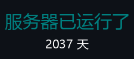
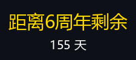

<!-- 标题 -->
<h1 align="center">牛腩小镇 | NewNanCity | JE 1.20.1</h1>

<!-- 横幅 -->
<p align="center"></p>
<p align="center">&nbsp;
&nbsp;
</p>

<p align="center"></p>
<!-- 欢迎信息 -->
<h3 align="center">/spawn</h3>
<p align="center">欢迎你牛子！牛腩小镇是一个开服超过五年，合计超过2000+玩家的中文圈插件生存服务器。</p>
<p align="center">在这里你可以体验我们的无与伦比的城镇玩法、铁路系统、还有管理员们开发的各种活动和小游戏！</p>
<p align="center">过来和我们这友爱和谐的大家庭一起玩耍吧！<a href="https://www.wolai.com/newnan/26gvpMzTrsoyjtb6L6cQW6">点我了解牛腩</a></p>
<table align="center">
  <tr>
    <td align="center" valign="top" alt="五周年纪念">
      <h3>🎉 五周年纪念 🎉</h3><p>牛腩镇五周年纪念场地</p>
    </td>
    <td align="center" valign="top" alt="开服两千天">
      <h3>✨ 开服 2000 天 ✨</h3><p>莫斯科大会堂</p>
    </td>
  </tr>
</table>

<p align="center"></p>
<!-- 新闻 -->
<h2 align="center">/mail read</h2>
<p align="center">牛腩时报：最新情报！曼巴小镇已开启！！</p>
<p align="center"></p>

> [!NOTE]
> 牛腩小镇！牛腩小镇！坠机了！
> 黑心攻击者，让几把猫欠下了三点五个亿！（牛币）
>
> ——现在，我们改名“曼巴小镇”，
> 把服务器当TNT，把崩溃当烟花！
> 来，一起把炸服开成狂欢，把废墟盖成景点。
> • TNT炸服赛：随便放置TNT，看哪里不爽就把它炸了（鼓励公报私仇）！放心，这个是备份世界，到时候主服开了不会受到任何影响。
> • 建筑battle：“炸服纪念碑”主题雕塑，占地20*20以内，优秀作品将会被永久放置于牛腩镇和其他城镇！
> • 不限制PVP大赛：随时随地，就地大战，没有任何限制！死了会有神秘战败CG哦

<p align="center"></p>
<!--选单-->
<h2 align="center">/nn</h2>
<p align="left">你可以使用此选单前往以下其中一个区域。</p>

- [/tpa 传送链接](#tpa)
- [/skin 皮肤站注册](#skin)
- [/client 客户端安装](#client)
- [/rules 牛腩法规](#rules)
- [/donate 捐赠](#donate)
- [下载页面](doc/download.md)

<p align="center"></p>
<!--牛腩链接-->
<h2 align="center" id="tpa">/tpa</h2>
<p align="left">
  <a href="https://newnan.city" target="_blank"></a> 牛腩小镇唯一的官方网站，包含最新资讯、规则、玩家法院等。
</p>
<p align="left">
  <a href="https://qun.qq.com/qqweb/qunpro/share?_wv=3&_wwv=128&appChannel=share&inviteCode=CdEFH&appChannel=share&businessType=9&from=181074&biz=ka&shareSource=5" target="_blank"></a> 加入QQ频道，与其他玩家互动，新人玩家进服审核必进。
</p>
<p align="left">
  <a href="https://skin.newnan.city"></a> 注册游戏帐号，获取自定义皮肤。
</p>
<p align="left">
  <a href="https://map.newnan.city"></a> 查看游戏地图，了解游戏地形。

</p>
<p align="left">
  <a href="https://space.bilibili.com/1704080503?spm_id_from=333.337.search-card.all.click"></a> 主要负责人 Starteamwuzhou 经营的牛腩官方Bilibili账号，发布宣传和游戏相关资讯、视频。
</p>
<p align="left">
  <a href="https://space.bilibili.com/528956334?spm_id_from=333.337.search-card.all.click"></a> 主要负责人 Martian 经营的牛腩官方Bilibili账号，发布牛腩公告相关资讯、视频。
</p>

<p align="center"></p>
<!-- 皮肤站注册教学 -->
<h2 align="left" id="skin">/skin 皮肤站注册</h2>
<details>
  <summary>皮肤站注册教学</summary>
  <p>
    1. 打开<a href="https://skin.newnan.city">皮肤站注册页面</a>，点击画面中间的"现在注册"。
  </p>
  <p>
    <br>
  </p>
  <p>
    2. 依次输入表单中的资料，然后点击注册，注册成功后登录。
  </p>
  <p>
    <br>
  </p>
  <p>
    3. 正常情况，皮肤站仪表盘的左下角会有一个方块，上面提供了第三方认证服务器地址。<br>但是牛腩不太正常，并没有提供，所以直接贴在这里了<br>https://skin.newnan.city/api/yggdrasil<br>请把此地址复制下来，登入客户端时会用上。
  </p>
  <p>
    <br>
  </p>
  <p>
    4. 皮肤站可以上传自己的皮肤和披风。
  </p>
  <p>
    <br>
  </p>
  <p>
    5. 点击皮肤库，可以查看所有上传的皮肤和披风（设定为私人皮肤除外）。
  </p>
  <p>
    <br>
  </p>
  <p>
    6. 如果你登入过并且让浏览器记住帐号密码了，当你再次回到皮肤站时，可以直接按“登录”按钮，无需重复输入用户名和密码，或者直接按进入用户中心，进入皮肤站。
  </p>
  <p>
    <br>

  </p>
</details>

---

<!-- 客户端安装教学 -->
<h2 align="left" id="client">/client 客户端安装和登入游戏教学</h2>
<details>
  <summary>PCL客户端安装教学</summary>
  
  ### PCL
  -  1. 请先安装牛腩主群或者 <a href="doc/download.md">下载页面</a> 给的客户端。<br>
    <br>
    <br>
    <br>
  -  2. 下载好之后解压缩，然后点开"Plain Craft Launcher.exe"。
    <br>
  -  3. 如果你是使用我们提供的客户端，可以直接使用你用皮肤站注册的帐号登入游戏，无需添加第三方认证服务器地址。<br>※ 如果你的PCL端是下载全新的纯启动器的话，请按照 <a href="#client_only">这里</a> 的步骤操作。<br>
    <br>
</details>
<details>
  <summary>HMCL客户端安装教学</summary>
  
  ### HMCL
  -  1. 请先安装牛腩主群或者 <a href="doc/download.md">下载页面</a> 给的整合包和纯净客户端。<br>
        ※注意！注意！注意！此整合包只适用于HMCL客户端。<br>
    <br>
    <br>
    <br>
        
      下载好之后请创建一个资料夹，把纯净客户端放到这个资料夹里面，这个资料夹将会是你的游戏资料夹。<br>
    然后点击"HMCL.exe"打开客户端。<br>
  -  2. 点击账户<br>
    <br>
  -  3. 点击添加认证服务器，然后把`https://skin.newnan.city/api/yggdrasil`粘贴上去。<br>
  为什么要添加认证服务器？由于牛腩是使用属于自己的皮肤站登录认证，等同于正版认证，登录加入玩家资料到服务器。<br>
    <br>
  -  4. 点击添加账户下面红框里面你刚添加过的认证服务器，然后登入你的账号。<br>
  如果你不是使用我们的整合包，那到这一步就可以了！<br>
    <br>
  -  5. 接下来点击版本列表。<br>
    <br>
  -  6. 点击安装整合包后，把你刚刚下载的整合包拖进去hmcl界面，<br>
    <br>
  -  7. 点击安装整合包后，等待安装完成。<br>
    <br>
  -  8. 点击版本列表，会发现启动器自动选择了你刚刚安装的整合包，然后返回界面首页就可以开始游戏了。<br>
    <br>
</details>

<p align="center"></p>
<!-- 规则 -->
<h2 align="center" id="rules">牛腩法规</h2>
<p align="center">
  <a href="https://www.wolai.com/newnan/777czodMK18Zv6hdy2b8jm"></a>
  <a href="https://www.wolai.com/newnan/a1XDDRgFFovKxWzScNXA5m"></a>
</p>
<details>
  <summary>

  #### 作为玩家，你不该做什么</summary>

- 小号入群（指多个号进牛腩以伪扮不同身份）。
- 开挂作弊。
    - **服务器提供了一些便利的插件，可以用来方便建造和生存，但是也可以用来一定程度的作弊（例如灵魂出窍功能）；请不要在违法的边缘试探，管理不会留情面的。**
- 连续恶意击杀玩家、破坏某玩家床或破坏重生点。
- 在牛腩从事违背所在国家/地区相关法律条例的活动。
- 在群内、服内、论坛等网站内以及通过以上渠道私下传播（包括但不限于）政治敏感、淫秽暴力、赌博传销等违法内容，或者在以上提到渠道从事其他违法行为。
    - **牛腩小镇服务器遵守中华人民共和国宪法与法律法规，如发现玩家有任何违法犯罪行为，将积极举报、配合公安与其他执法监察部门对相关行为进行制裁。**
- 关于zz敏感等话题：玩梗过度会烦到别人，对你们自己也没好处。如果想谈可以去牛腩玩家自建的[同好群](https://jq.qq.com/?_wv=1027&k=jVor3g3J)谈论。在大群处理不好自己说话尺度的一律发飞机票。
- 禁止讨论七天以内出现的政治、社会事件，违者禁言一个月。
- 以广告为目的发布其他服务器、运营商信息。
- 游戏内财产和现实世界或者其他服务器资金资产的交易，或者其广告。
- 随意泄露他人隐私（服务器内不限制玩家爆照，手机号，住址等个人信息，但其余玩家不应在无理由情况下四处传播当事人的个人信息，即使当事人已经在大群发出过，没有当事人允许依然不行）
    - **民法典规定，未经肖像权人同意，肖像作品权利人不得以发表、复制、发行、出租、展览等方式使用或公开肖像权人的肖像**
- 在群内、服内、论坛等网站内谩骂、侮辱、威胁、骚扰或者阴阳怪气其他玩家或玩家群体（如城镇、联盟、协会等），以及做出破坏服务器团结稳定的行为。
    - **注意：如果你是受害者，遭遇了此条内不愉快的事情，请及时提出并将记录截图发送给管理员。而如果你是施害者，应当第一时间道歉。请勿说：“我只是想开个玩笑而已”。类似的话，玩笑应该使人开心，而不是让人难受。**
- 在其他网站、群或者服务器中为牛腩引战、招黑，或者进行未授意的与牛腩相关的宣传或者讨论，对牛腩名誉造成恶劣影响。
    - 如玩家在其他群发现有其他玩家有此类行为，或其他非牛腩的朋友发现有人顶着牛腩的名义对你们带来困扰的，请直接联系我们。（直接来审核服、b站评论私信或者在这里评论都可以，或者任何能联系到我们的方式，感谢）
- 恶意、虚假举报。
- 有意进行服内偷盗，或对他人/他镇/公共建筑、设施、作物和实体进行破坏、改造(未经允许)。
- 利用游戏内的恶性Bug（包括但不限任意物品复制）。
- 制作各类卡服的机器，制作区块强制加载的机器，并在管理员的警告下不停止。
- 毫无必要地破坏地形、制造不美观的建筑、在奎特世界乱用 WorldEdit 指令。
- 新人入服的前三天，禁止各**城镇，组织，等各类玩家集团**过于主动的招揽新人（禁止例子：物资引诱加入，铺天盖地宣传，最强/最厉害/最大字样，抨击其他城镇抬高自己城镇，刷屏广告，等）（允许例子：带领对方游览，事后顺便问一嘴，或是介绍自身城镇特色）
- 不应当把自己的号借与他人使用，否则出现任何情况以及由此引申的处罚，后果自负。
    - **特别提醒，真人真事，某前玩家将自己的号给“妹妹”玩，“妹妹”并不知道这是服务器，从别的玩家那里拿走了大量物品，被判定为恶意偷窃，永久封禁。**

</details>
<details>
<summary>

#### 作为玩家，你需要知道哪些事情</summary>

- 你必须完成入群流程才能获得与主世界互动的权限，必须完成绑定才能开玩。但是要注意：**新入服的玩家处于试玩考核期（时间长度处于15~30天不等），会参考广大玩家意志与管理组裁决来决定去留，考核期被劝退的概率更高，最终解释权归管理组所有。**
- 若你介绍了你的一位朋友来牛腩小镇，那么如果你的朋友有违反法典的行为，你也将会受到一定的惩罚，所以请督促好你的朋友。
- 所有人都可以使用`/co i`等指令查询方块的历史记录(详情请见)，欢迎加入「风纪委员」组织，任何时候欢迎并鼓励使用[匿名举报问卷](https://wj.qq.com/s2/7503914/7fed)。
- 你有权为服务器提出宝贵建议：通过[匿名建议问卷](https://wj.qq.com/s2/8200397/3c46)或者找管理谈心，如果有些话不好说，私聊腐竹替你保密。
- 在牛腩「OP」≠「管理」≠「管理组」，管理组是所有为牛腩无私工作的玩家整体，而管理是其中的一种岗位，OP是在游戏中拥有裁决特权的玩家，详见[管理组的组成结构](https://www.wolai.com/newnan/qBSQsymWM5LpDzPugArrMy)。
- 你有权选择自己喜欢的城镇，或者选择一个人玩耍。
- 如果你退出了大群，那么你的账号将会暂时冻结(进不了游戏)，直到你回来。
- 这是一个公益的服务器，管理的帮助和服务器提供的服务是自愿而非义务，请保持尊重和相互体谅。
- 社区氛围是共同维护的，请不要做害群之马，那样只会被驱逐出境。
- 这里不是快餐服，也不打算做快餐服；同时我们虽然不是完全纯原版，但是也不想做成花式插件服。我们是高冷的小服，不求人多，只求一起开心。
- 请一起快乐的玩耍。

https://zhuanlan.zhihu.com/p/109918158

</details>
<details>
<summary>

#### 在管理组，你需要知道的事情</summary>

- 禁止和玩家进行人上人交流，权力不是用来炫耀的。
- 管理组违规，罚的更重；以权谋私，螺旋升天。
- 只有心理成熟才能胜任管理这一岗位，就像其他岗位也需要各自的特长一样。
- 对违规玩家要零容忍，不能心慈手软。但是有两个原则：基于确凿的证据，根据实际情况量刑。

</details>
<details>
<summary>

#### 城镇制度</summary>

- 允许玩家建立新城镇，但是需要满足一定的条件，并且请考虑清楚自己有没有把城镇做好、做久的能力和精力。
- 城镇是分级别的，级别越高，可以拥有越多的权力，也必须承担越多的义务(主要是要坚持把你的城镇做下去)，如果做的不够好，就会降级，甚至撤销城镇资格。
- 城镇不是独立于游戏的政治集体，城镇应当在听从管理组安排的前提下自由发展，请勿在牛腩玩政治权力游戏，管理组有权干预城镇行政、任免镇长以及解散城镇。
- 每个镇必须选出一个镇长，作为镇与管理组的第一联络人，镇长应当经常反馈城镇玩家意见、配合管理组工作、领导城镇发展并管理好治安秩序。镇长属于管理组编制，所以管理组行为规范也适用。
- 如果镇长无法带头起到模范作用、带领镇子长期咕咕咕(开学期间可以做一定容忍)、带头闹事整活、城镇治安差，管理组会撤销镇长职务并重新组织公投选举。
- 城镇内部问题，优先在城镇内部解决；城镇之间问题，优先通过双方谈判解决；城镇与管理组之间问题，要及时传达你们的真实诉求，如果有什么话不好说，那就私戳腐竹，腐竹替你们保密。
- 城镇扩张要合理、占地要讲理，地不够可以找腐竹商量。如果城镇之间出现“领土”纠纷，首先参照上一条，如果无法解决，请找管理组。
- 分级详情、其他内容请见[牛腩城镇法](https://docs.qq.com/doc/DUHZma0NQRWxsY1N6)。

</details>
<details>
<summary>

#### 风纪委员制度</summary>

- 「风纪委员会」最初由玩家自发发起，后来成为直属于腐竹的玩家自发的民间治安组织。
- 「风纪委员会」由委员长和委员组成。委员被要求保密自己的身份(毕竟还是要保护你们的安全嘛)，现任委员长由 `Sttot` 担任，想加入就找他。
- 风纪委员在权力上和普通玩家一样，工作是在日常游戏中举报熊孩子、作弊等违规或者不良行为，或者为一些案件提供有用的线索，同时报告一些好人好事，弘扬正气。宗旨是为自己、朋友和所有玩家争取更好的游戏氛围，维护我们的净土。
- 「风纪委员会」的所有玩家都是值得赞扬的，作为牛腩小镇无名的护花使者，虽默默无闻、忍辱负重，但我们会永远记得你们！你们对牛腩的安定功不可没。

</details>
<details>
<summary>

#### 如果违背了《法典》会受到什么惩罚</summary>

《法典》对所有违规行为没有明确量刑，本着“零容忍”和“实事求是”的态度根据实际情况判罚。

可参考的惩罚如下：

- 罚款、赔物、修理毁坏建筑设施。
- 挂到群公告、牛腩时报和论坛上反复捶打。
- 临时封禁
- 永久封禁

以上惩罚可叠加使用。


**特别注意：“实事求是”也应当包括考量玩家的素质与贡献。因此，可根据以下几点对受惩罚玩家加以减罚：**

1. 态度积极：如多赔偿、自首、主动供出同伙提供重要线索；
2. 将功抵过：结合服务器贡献与玩家声誉；
3. ~~女装照谢罪(并不)；~~

</details>
<details>
<summary>

#### 建筑师制度</summary>

暂无


  </summary>
</details>

<p align="center"></p>
<!-- 捐赠 -->
<h2 align="center" id="donate">捐赠</h2>
<p align="center">
  <a href="https://www.wolai.com/newnan/jjrRipUsK76KDaAe4uRwBS"></a></p>

```html
牛腩小镇是公益服务器，平时用爱发电，欢迎各位赞助！
钱无论多少，你的支持就是我们最大的荣幸！
如果愿意，请量力而行，1块也可以，很多玩家都是学生，没有挣钱能力，请节俭一些（富哥随意）！
本服不是商业服，赞助行为不会回报以任何氪金服务
我们会在本页面和上面的链接鸣谢所有赞助者，并保证资金流向的透明
（更新会有延迟）。
```
